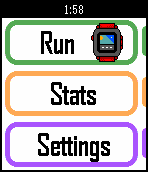
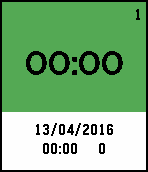
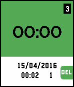
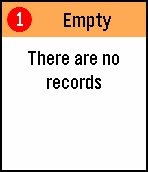
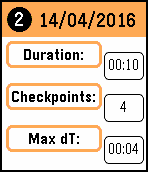
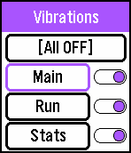

# RunMax #

Watchapp written in C for the Pebble Time watches. This watchapp keeps 5 records, each record holding up to 10 checkpoints.

1. Main window to navigate to the run, stats, and settings windows

2. Run window showing:
    1. Timer and current record number
    2. Date when the checkpoints were recorded
    3. The last checkpoint time and the number of checkpoints in record

3. Stats window with three tabs:
    1. Overview tab:
      * Total duration of record
      * Number of checkpoints in record
      * Maximum duration between two checkpoints
    2. Checkpoints tab - shows time recorded in each checkpoint
    3. Durations tab - shows time durations between checkpoints

4. Settings window:
    * Changes the vibration settings of each window

- - - -

##Screenshots of the watchapp:##

'1.' Main window:

  

'2.' Run window:

       

'3.' Stats window:

          

'4.' Settings window:

